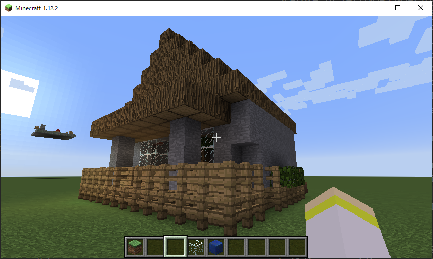

# Mcgpt Builder
Minecraft Automated Building with GPT ([M3 Tech Book 7](https://techbookfest.org/product/g2gqKCQ96newVVkru0YgAm?productVariantID=rVnrwrVH1qJWm0qxss1Vpd), Chapter 7)

## Introduction

Mcgpt Builder can generate Python code to create buildings specified in the Minecraft chat field through the OpenAI API and automatically build it in the Minecraft world.



## Requirements

- Python 3.9.x (to use mcpi)
- Minecraft Java Edition 1.12.x
- The versions of the required Python libraries are listed in `requirements.txt`:
    ```
    PyYAML==6.0.2
    openai==1.47.0
    mistletoe==1.4.0
    mcpi==1.2.1
    ```

## Setup

1. Install Python libraries.
    ```bash
    $ pip install -r requirements.txt
    ```
2. Install [Minecraft Forge](https://files.minecraftforge.net/net/minecraftforge/forge/index_1.12.2.html) for Minecraft 1.12.x.

3. Install [Raspberry Jam Mod](https://github.com/arpruss/raspberryjammod) for Minecraft 1.12.x.

4. Get the OpenAI API key from [OpenAI website](https://beta.openai.com/signup/) and set the environment variable `OPENAI_API_KEY`.
    ```bash
    $ export OPENAI_API_KEY='your-api-key'
    ```

5. Put `mcgpt.py` and `config.yaml` to your .minecraft/mcpipy directory.
    ```bash
    $ cp src/mcpipy/* <path_to_.minecraft>/mcpipy/
    ```

## How to use

Execute the following command in Minecraft chat.
```
/py mcgpt <desired building>
```
